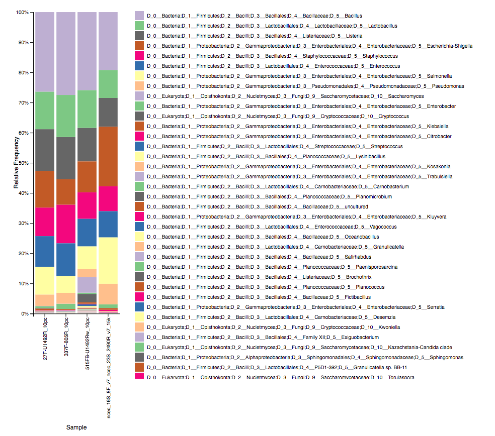
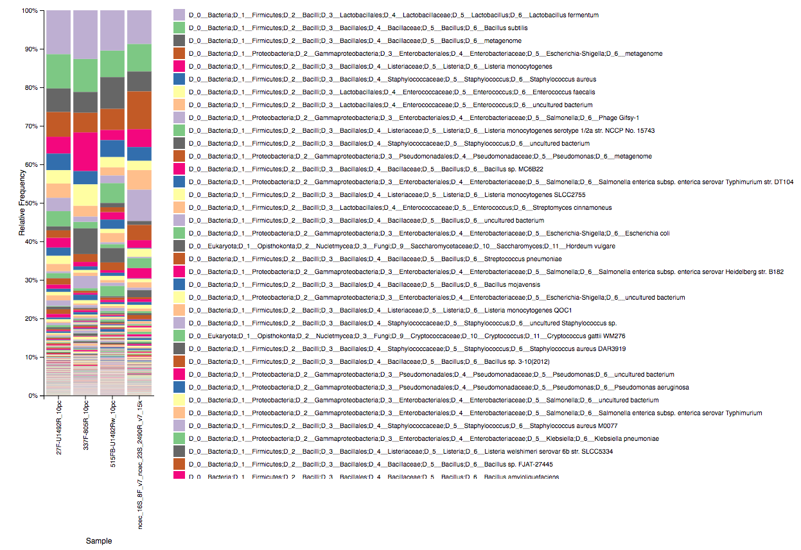
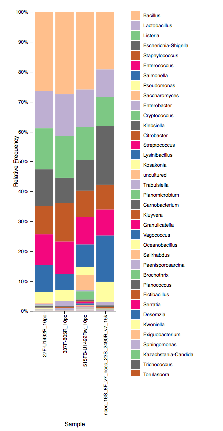
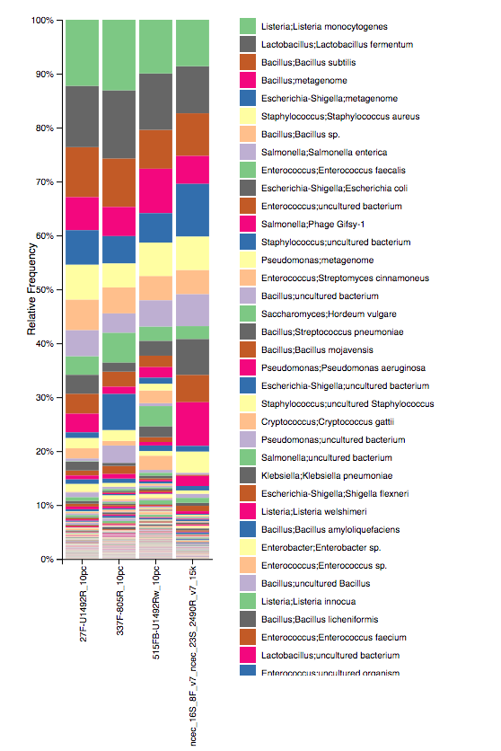

## context

By default Qiime2 produces boxplot labels covering the full taxonomy length (up to 7 levels in my case). These levels print ugly when data is submitted to the very neat **[Qiime2view](https://view.qiime2.org/)**

A simple pileline is shown below to produce 2-level data and create a more readable plot from it at either genus or species level.

The method can be divided as follows (thanks to the post by **[Nicholas_Bokulich](https://forum.qiime2.org/t/command-or-tool-to-shorten-the-very-long-labels-in-viewer-from-taxa-bar-plots-qzv/12023/3))**

## method

* export the current **taxonomy.qza** to a **.tsv** file using qiime export

```
qiime tools export --input-path taxonomy.qza --output-path taxonomy_export
```

* adapt the **.tsv** file to simplify the taxon column to your needs, (genus and species shown here)
  - a custom bash functions has been created to operate on genus and species levels adn remove obsolete text from the labels.

    ```
    # a variant for data from Silva (which adds D_.*__ to each level)
    function cleantaxonomy (){
      glev=6
      slev=7
      outfolder=taxonomy_genus_species
      mkdir -p ${outfolder}
      gawk -v glev="${glev}" -v slev="${slev}" 'BEGIN{FS="\t"; OFS="\t"}\
        {
          if(NR==1){print $0} else {
            split($2,tax,";"); \
            genus=tax[glev]; gsub("D_.*__", "", genus); split(genus,gena," "); \
            gen=gena[1]; gsub(/[ \t]+$/,"",gen); \
            species=tax[slev]; gsub("D_.*__", "", species); split(species,spea," "); \
            spe=spea[1]" "spea[2]; gsub(/[ \t]+$/,"",spe); \
            print $1,gen";"spe,$3
          }
        }' $1 > "${outfolder}/$(basename ${1%.tsv}).tsv"
    }
    
    # a variant for the data fromrrnDB
    function cleantrrndb (){
      glev=5
      slev=6
      outfolder=taxonomy_genus_species
      mkdir -p ${outfolder}
      gawk -v glev="${glev}" -v slev="${slev}" 'BEGIN{FS="\t"; OFS="\t"}\
        {
          if(NR==1){print $0} else {
            split($2,tax,";"); \
            if(length(tax)==slev && tax[glev]!="NA"){
              genus=tax[glev]; split(genus,gena," "); \
              gen=gena[1]; gsub(/[ \t]+$/,"",gen); \
              species=tax[slev]; split(species,spea," "); \
              spe=spea[1]" "spea[2]; gsub(/[ \t]+$/,"",spe); \
              print $1,gen";"spe,$3
            }
          }
        }' $1 > "${outfolder}/$(basename ${1%.tsv}).tsv";
    }
    ```

```
# clean the exported file with
cleantaxonomy taxonomy.tsv
```

* convert the new folder and contained modified **.tsv** file back to a **qza** artefact

```
# reimport
qiime tools import \
  --type FeatureData[Taxonomy] \
  --input-path taxonomy_genus_species \
  --output-path taxonomy_cleaned.qza
```

* produce the **qzv** input for the viewer (requires $SAMPLE_METADATA defined before)

```
# choose either qza from (cleaned-table-no-unassigned.qza)
qiime taxa barplot \
  --i-table table.qza \
  --i-taxonomy taxonomy_cleaned.qza \
  --m-metadata-file $SAMPLE_METADATA \
  --o-visualization cleaned-taxa-bar-plots.qzv
```

* optionally filter out 'unclassified/unassigned' rows in the **table.qza** if you do not want them in the barplot

```
qiime taxa filter-table \
  --i-table table.qza \
  --i-taxonomy taxonomy.qza \
  --p-exclude Unassigned \
  --o-filtered-table table-no-unassigned.qza
```

* produce the **qzv** input for the viewer (requires $SAMPLE_METADATA defined before)

```
# choose either qza from (cleaned-table-no-unassigned.qza)
qiime taxa barplot \
  --i-table table-no-unassigned.qza \
  --i-taxonomy taxonomy_cleaned.qza \
  --m-metadata-file $SAMPLE_METADATA \
  --o-visualization cleaned-no-unassigned-taxa-bar-plots.qzv
```
* upload the created **taxa-bar-plots.qzv** to the viewer

## examples

The first plot shows the very long labels obtained at genus and species level with the MetONTIIME data (after removing unclassified data)





After cleaning the taxonomy labels, the genus and species levels are shown below. 

**Note:** Additional advantage of the cleaning was to merge all subspecies of a given species to the same label. Indeed, a number of records in the Silva database include subspecies information which may not be relevant in such plot and led to several bar regions mapping to the same species (an extreme example here: 'Listeria monocytogenes serotype 1/2a str. NCCP No. 15743' => 'Listeria monocytogenes' after cleaning). After cleaning, all subspecies get mapped to the same species and the order of the abyundance changes slightly.





**Please let me know if you find typos or inconsistencies and of course suggest additional tracks using the Issue tracker above**

*&copy;Stephane Plaisance, VIB-Nucleomics Core*

------------


This work is licensed under a [Creative Commons Attribution-ShareAlike 3.0 Unported License](http://creativecommons.org/licenses/by-sa/3.0/).
